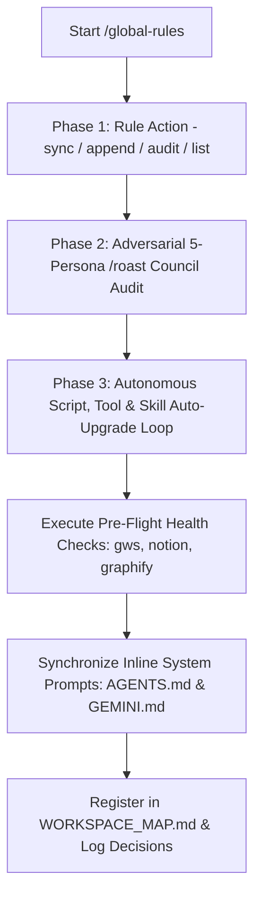

# ZORIXEL AIOS Global Rules & Error Prevention Engine (`/global-rules`)

## ⚡ Overview & Tri-Mode Execution

This skill automates the management, appending, auditing, and multi-file synchronization of the ZORIXEL AIOS global error prevention rules. It incorporates an **Adversarial `/roast` Council Audit Gate** and an **Autonomous Script, Tool & Skill Auto-Upgrade Loop** to ensure that whenever new rules or error lessons are added, all workspace tools, health scripts, and active skills auto-upgrade in tandem.

As a result, **every new AI agent chat session automatically loads and enforces 100% of these rules from line 1 of every session without needing manual user prompting**.

Invokable via:
- **Slash Command**: `/global-rules [action]` or `/sync-global-rules`
- **Dynamic Intent**: Triggered automatically when discovering new terminal errors, writing system rules, or completing session post-mortems.
- **Programmatic Inter-Skill Calling**: Invoked by `/session-postmortem-audit`, `/improve-system`, `/os-audit`, `/new-client`, or `/gstack`.

---

## 🎯 3-Phase Execution Architecture



---

## 📑 PHASE 1: RULE ACTION & MANIFESTATION

### Mode 1: Synchronize (`/global-rules sync`)
- Executes `python scripts/sync_global_rules.py` via `run_command`.
- Copies the complete block from `references/GLOBAL_ERROR_PREVENTION_RULES.md` into the inline comment blocks inside `AGENTS.md` and `GEMINI.md`.
- Confirms zero drift across system prompts.

### Mode 2: Append New Rule (`/global-rules append "[Category]" "[Rule Text]"`)
- Reads `references/GLOBAL_ERROR_PREVENTION_RULES.md`.
- Auto-increments the next Rule ID (e.g. `Rule 1.12`).
- Formats and appends the new rule to Section 1 or Section 2.
- Proceeds immediately to Phase 2 for adversarial stress-testing.

### Mode 3: Audit Alignment (`/global-rules audit`)
- Scans `AGENTS.md`, `GEMINI.md`, and `references/GLOBAL_ERROR_PREVENTION_RULES.md` for missing markers or formatting errors.
- Verifies that both `AGENTS.md` and `GEMINI.md` contain the `<!-- BEGIN INLINE GLOBAL ERROR PREVENTION RULES -->` markers.

### Mode 4: List Rules (`/global-rules list`)
- Displays the complete 11 Error Prevention Rules and 7 Delivery Policies in clean markdown table format.

---

## 🔥 PHASE 2: ADVERSARIAL `/roast` COUNCIL AUDIT GATE

Before finalizing any rule addition or system prompt edit, convene the 5-Persona ZORIXEL AIOS Roast Council (`/roast`):

1. **The Contrarian (Red Team)**: Finds hidden edge cases, terminal shell mangling risks, token leak hazards, or un-tested load-bearing assumptions in the new rule.
2. **The Logician (First Principles)**: Audits logical integrity, ensures formula null guards and regex sanitizations are 100% deterministic.
3. **The Expansionist (Bull)**: Evaluates if the rule can be codified into an automated pre-flight Python script in `scripts/`.
4. **The Researcher (Evidence)**: Verifies CLI parameters, API routes, and vendor documentation (e.g., Notion Formula 2.0 specs, Google Workspace CLI paths).
5. **The Buyer / Operator (Atinek Maurya)**: Confirms the rule eliminates future manual user corrections and saves session execution time.

---

## 🔄 PHASE 3: AUTONOMOUS SCRIPT, TOOL & SKILL AUTO-UPGRADE LOOP

After completing Phase 1 and Phase 2, execute the autonomous auto-upgrade loop:

1. **Synchronize Inline System Prompts**: Run `python scripts/sync_global_rules.py` via `run_command` to inject updated rules inline into `AGENTS.md` and `GEMINI.md`.
2. **Run Pre-Flight Health Sweep**:
   - `python scripts/aios_gws_health_check.py` (Verify Node.js, `gws run.js`, OAuth tokens, GCP Drive/Sheets APIs).
   - `python scripts/test_notion_formula.py` (Verify Notion formula syntax and parens balance).
   - `python scripts/graphify_runner.py status` (Verify knowledge graph hubs and UTF-8 encoding).
3. **Auto-Upgrade Related Tools, Scripts & Skills**:
   - If the new rule introduces a new execution safeguard (e.g., a new Windows shell escaping rule or API check), automatically update the corresponding helper script in `scripts/` or skill in `.agents/skills/` using `replace_file_content` or `write_to_file`.
4. **Register & Log**:
   - Update `WORKSPACE_MAP.md` with new/modified files.
   - Log the system upgrade in `decisions/log.md`.

---

## 🛡️ Non-Negotiable Error Rules Summary

| Category | Rule | Key Safeguard |
|---|---|---|
| **Shell & Execution** | Rule 1.1 | Isolate complex Python code into `scratch/*.py` files. Never pass parens inside double-quoted PowerShell commands. |
| **Path & Binary** | Rule 1.2 | Npm binaries on Windows are `.cmd` files. Target Node directly (`node run.js`) with `shell=False`. |
| **CLI Wrapper** | Rule 1.3 | Avoid multi-line semicolon variable chaining in raw `run_command` calls. |
| **OAuth Auth** | Rule 1.4 | Execute `python scripts/aios_gws_health_check.py` before running GWS automations. |
| **Argument Passing** | Rule 1.5 | Pass Python `json.dumps()` dict payloads via Node directly (`shell=False`) to prevent `cmd.exe` quote stripping. |
| **GCP Platform** | Rule 1.6 | Intercept HTTP 403 API disabled errors and present direct GCP console enable links. |
| **Encoding** | Rule 1.7 | Use standard ASCII tags (`[OK]`, `[ERROR]`) and enforce UTF-8 `errors='replace'` in subprocess output. |
| **Formula Engine** | Rule 1.8 | Notion Formula 2.0 does not support browser JS APIs (`encodeURIComponent`). Pre-encode `%20` / `%0A`. |
| **Formula Engine** | Rule 1.9 | Wrap EVERY property reference in defensive `if(empty(prop("...")), ...)` null guards. |
| **Web Endpoint** | Rule 1.10 | Use updated Notion developer portal route `https://app.notion.com/developers/connections`. |
| **API Protocol** | Rule 1.11 | Support both `secret_` and `ntn_` prefixes for Notion integration tokens. |

---

## 🐍 Python Execution Boilerplate for Appending Rules & Auto-Upgrading

```python
import os
import subprocess

WORKSPACE_ROOT = os.path.dirname(os.path.dirname(os.path.dirname(os.path.abspath(__file__))))
REF_RULES_PATH = os.path.join(WORKSPACE_ROOT, "references", "GLOBAL_ERROR_PREVENTION_RULES.md")
SYNC_SCRIPT = os.path.join(WORKSPACE_ROOT, "scripts", "sync_global_rules.py")
GWS_CHECK_SCRIPT = os.path.join(WORKSPACE_ROOT, "scripts", "aios_gws_health_check.py")
NOTION_CHECK_SCRIPT = os.path.join(WORKSPACE_ROOT, "scripts", "test_notion_formula.py")

def append_sync_and_upgrade(category, rule_title, rule_detail):
    # 1. Read & Append
    with open(REF_RULES_PATH, "r", encoding="utf-8") as f:
        content = f.read()
        
    rule_count = content.count("**Rule 1.") + 1
    new_rule_line = f"| **Rule 1.{rule_count}** | **{category}** | High | **{rule_title}**: {rule_detail} |\n"
    
    table_end = content.find("\n---\n\n## 🎯 SECTION 2")
    if table_end != -1:
        updated_content = content[:table_end] + new_rule_line + content[table_end:]
    else:
        updated_content = content + "\n" + new_rule_line
        
    with open(REF_RULES_PATH, "w", encoding="utf-8") as f:
        f.write(updated_content)
        
    # 2. Sync system prompts
    subprocess.run(["python", SYNC_SCRIPT], check=True)
    
    # 3. Run health sweep
    subprocess.run(["python", GWS_CHECK_SCRIPT], check=True)
    subprocess.run(["python", NOTION_CHECK_SCRIPT], check=True)
    
    print(f"[SUCCESS] Appended Rule 1.{rule_count}, synchronized system prompts, and completed pre-flight health sweep!")
```

---

## 🔗 Inter-Skill Connections
- **Post-Mortem Auto-Updater**: Programmatically invoked by `/session-postmortem-audit` in Phase 3.
- **System Improvement**: Programmatically invoked by `/improve-system` to merge learned error rules into permanent AIOS memory.
- **System Audit**: Programmatically invoked by `/os-audit` to verify system prompt rule synchronization.
- **Adversarial Gate**: Integrates `/roast` in Phase 2 before completing any rule addition.

---

## 🔄 Post-Execution Auto-Evolution & Adversarial `/roast` Gate

At the completion of every execution of this skill:

1. **Adversarial `/roast` Council Review**: Convene the 5-Persona ZORIXEL AIOS Roast Council (`/roast`) to stress-test the output, code edits, or strategy generated by this skill. Red-team for missing edge cases, terminal shell bugs, token leaks, or optimization gaps.
2. **Autonomous Tool, Script & Skill Auto-Upgrade Loop**:
   - If new error patterns or execution safeguards are discovered, append them to `references/GLOBAL_ERROR_PREVENTION_RULES.md` and execute `python scripts/sync_global_rules.py` via `run_command` so system prompts (`AGENTS.md` and `GEMINI.md`) auto-update inline.
   - Run pre-flight health checks (`aios_gws_health_check.py`, `test_notion_formula.py`, `graphify_runner.py`).
   - Self-upgrade this `SKILL.md` instruction file with newly learned edge cases using `replace_file_content` or `write_to_file`.
3. **Register & Log**: Log milestone upgrades in [WORKSPACE_MAP.md](file:///d:/AI-OS/WORKSPACE_MAP.md) and [decisions/log.md](file:///d:/AI-OS/decisions/log.md).

