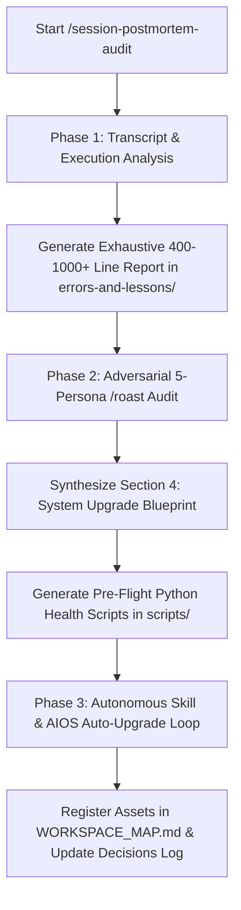

# ZORIXEL AIOS Session Post-Mortem & System Evolution Engine (`/session-postmortem-audit`)

## ⚡ Overview & Tri-Mode Execution

This skill automates the complete post-mortem audit, system self-improvement, and skill auto-evolution cycle for Atinek Maurya's AIOS. It converts session friction, terminal bugs, prompt iterations, and successful patterns into permanent pre-flight scripts, hardened system rules, copy-pasteable reusable skill specifications, and self-upgrading agent instructions.

Invokable via:
- **Slash Command**: `/session-postmortem-audit` or `/session-report`
- **Dynamic Intent**: Triggered automatically after completing major coding sprints, client deliverables, system refactors, or multi-tool debugging sessions.
- **Programmatic Inter-Skill Calling**: Invoked by `/session-handoff`, `/gsd-complete-milestone`, `/improve-system`, or `/gstack`.

---

## 🎯 3-Phase Execution Architecture

---

## 📏 MANDATORY DEPTH & LENGTH CONSTRAINT (400 TO 1000+ LINES)

> **CRITICAL REQUIREMENT:** The generated report MUST NOT be brief, summarized, or condensed into a few superficial bullet points. Every execution MUST produce a detailed, un-summarized, production-grade Markdown document between **400 and 1000+ lines** in length.

---

## 📑 PHASE 1: TRANSCRIPT ANALYSIS & REPORT GENERATION

Inspect the entire conversation history, transcript logs (`<appDataDir>\brain\<conversation-id>\.system_generated\logs\transcript.jsonl`), executed tool calls, terminal outputs, and file diffs. Create a new markdown report inside `errors-and-lessons/SESSION_POSTMORTEM_ERRORS_LESSONS_AND_SKILLS.md` (or timestamped equivalent) containing three un-summarized, exhaustive sections:

### Section 1: Comprehensive Terminal, Syntax, API & Environment Error Catalog
For EVERY error (syntax glitch, subprocess path error, shell quote mangling, expired OAuth token, HTTP 403 API block, or formula exception):
- **Error Categorization Matrix**: Classify by Shell & Execution, Path & Binary, CLI Wrapper, OAuth Auth, Argument Passing, GCP Platform, Encoding, Formula Engine, or API Protocol.
- **Exact Error Log**: Paste the raw terminal error snippet or traceback.
- **Empirical Root Cause**: Explain why the OS, shell, tool parameter, or API rejected the call.
- **Effective Solution**: Detail the exact code/command fix that permanently resolved the issue.
- **Mandatory Pre-Execution Rule**: Formulate a strict rule (e.g., `Rule 1.X`) to be added to workspace rules or pre-flight checklists to prevent re-occurrence.

### Section 2: User Instruction-to-Delivery & Tweak Iteration Audit
Trace every prompt given by Atinek Maurya:
- **User Instruction**: Quote or summarize the user's intent.
- **Desired Output**: Define the target deliverable.
- **Iteration Count**: Log how many tweaks/attempts were needed before achieving 100% satisfaction.
- **AIOS First-Try Rule**: Formulate the exact execution policy so AIOS delivers the output on the FIRST attempt in future sessions without requiring user corrections.

### Section 3: Repeatable Patterns & Reusable Skill Specifications
Identify every repeatable workflow pattern discovered during the session (e.g., formula building, CLI subprocess wrapping, zero-cost client OS design, interactive setup dashboards):
- Write complete, production-grade `SKILL.md` templates (YAML frontmatter + step-by-step instructions + code patterns) ready to be saved into `.agents/skills/`.

---

## 🔥 PHASE 2: ADVERSARIAL `/roast` COUNCIL AUDIT & BLUEPRINT EXPANSION

Convene the ZORIXEL AIOS 5-Persona Roast Council (`/roast`) to stress-test the Phase 1 report and transcript:

### The 5-Persona Council Review
1. **The Contrarian (Red Team)**: Identifies missing edge cases, unmentioned terminal bugs, shell mangling risks, or un-tested load-bearing assumptions.
2. **The Expansionist (Bull)**: Uncovers 10x automation opportunities, missing leverage points, and automated pre-flight health script ideas.
3. **The Logician (First Principles)**: Audits logical integrity, ensures formula null guards are 100% deterministic, and categorizes error patterns cleanly.
4. **The Researcher (Evidence)**: Verifies vendor documentation, CLI syntax standards, and 2026 platform API updates.
5. **The Buyer / Operator (Atinek Maurya)**: Evaluates whether the report eliminates future manual work, reduces session time, and enables 1-click AIOS upgrades.

### Section 4 Expansion: ZORIXEL AIOS Permanent Upgrade Blueprint & Pre-Flight Scripts
Expand the report to include Section 4:
- **Verdict & Scores**: Log the Council verdict (GO / RESHAPE / KILL) and scores out of 10.
- **Production Pre-Flight Python Scripts**: Provide full, runnable Python source code for automated health checks (e.g. `scripts/aios_gws_health_check.py`, `scripts/test_notion_formula.py`) that test environment readiness BEFORE running complex workflows.
- **System Prompt Rules**: Provide exact rule snippets to be appended to `AGENTS.md` or `.agents/rules/`.

---

## 🔄 PHASE 3: AUTONOMOUS SKILL & AIOS AUTO-UPGRADE LOOP

After completing Phase 1 and Phase 2, execute the self-evolution loop to make AIOS smarter with every run:

1. **Auto-Generate Pre-Flight Scripts**: Automatically write/update all runnable Python pre-flight health scripts specified in Section 4 directly into `scripts/` using `write_to_file`.
2. **Execute Health Checks**: Run `python scripts/<preflight_script>.py` via `run_command` to verify that the health scripts execute cleanly with 100% success.
3. **Synchronize Global Rules into System Prompts**: Append any newly discovered error prevention rules to `references/GLOBAL_ERROR_PREVENTION_RULES.md` and run `python scripts/sync_global_rules.py` via `run_command`. This ensures `AGENTS.md` and `GEMINI.md` are updated inline so that **all future chat sessions automatically load new rules into system prompt memory on startup**.
4. **Auto-Evolve Skill Instructions**: Review the findings of `/roast` against `.agents/skills/session-postmortem-audit/SKILL.md` (and any related active skills). Update the skill file itself with newly discovered edge cases, shell rules, or prompt safeguards using `replace_file_content` or `write_to_file`.
5. **Register & Log**:
   - Register all new reports, health scripts, and skill updates in [WORKSPACE_MAP.md](file:///d:/AI-OS/WORKSPACE_MAP.md).
   - Log milestone decisions in [decisions/log.md](file:///d:/AI-OS/decisions/log.md).
6. **Persist System Learnings**: Suggest running `/improve-system` to merge these lessons into global AIOS memory.

---

## 🔄 Post-Execution Auto-Evolution & Adversarial `/roast` Gate

At the completion of every execution of this skill:

1. **Adversarial `/roast` Council Review**: Convene the 5-Persona ZORIXEL AIOS Roast Council (`/roast`) to stress-test the output, code edits, or strategy generated by this skill. Red-team for missing edge cases, terminal shell bugs, token leaks, or optimization gaps.
2. **Autonomous Tool, Script & Skill Auto-Upgrade Loop**:
   - If new error patterns or execution safeguards are discovered, append them to `references/GLOBAL_ERROR_PREVENTION_RULES.md` and execute `python scripts/sync_global_rules.py` via `run_command` so system prompts (`AGENTS.md` and `GEMINI.md`) auto-update inline.
   - Run pre-flight health checks (`aios_gws_health_check.py`, `test_notion_formula.py`, `graphify_runner.py`).
   - Self-upgrade this `SKILL.md` instruction file with newly learned edge cases using `replace_file_content` or `write_to_file`.
3. **Register & Log**: Log milestone upgrades in [WORKSPACE_MAP.md](file:///d:/AI-OS/WORKSPACE_MAP.md) and [decisions/log.md](file:///d:/AI-OS/decisions/log.md).

