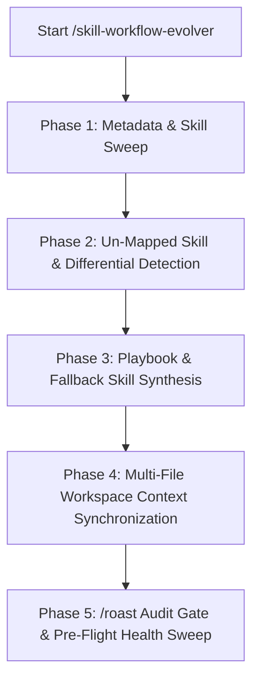

# ZORIXEL AIOS Skill Workflow Evolver Engine (`/skill-workflow-evolver`)

## Overview & Tri-Mode Execution

This skill automates the detection, mapping, and self-expansion of workflow playbooks whenever Atinek Maurya installs or creates new skills, tools, or MCP servers.

Invokable via:
- **Slash Command**: `/skill-workflow-evolver` or `/evolve-workflows`
- **Dynamic Intent**: Triggered automatically after running `/ingest-repo`, `/skill-creator`, `/setup-matt-pocock-skills`, or adding new skills to `.agents/skills/`.
- **Programmatic Inter-Skill Calling**: Invoked by `/session-postmortem-audit`, `/improve-system`, or `auto_evolve_all_skills.py`.

---

## 5-Phase Self-Upgrading Execution Loop

---

## 📑 Phase-by-Phase Execution Protocol

### Phase 1: Metadata & Skill Sweep
Run `python scripts/skill_workflow_evolver_runner.py` via `run_command` to scan all `.agents/skills/` and global config skill folders (`C:\Users\HP\.gemini\config\skills\`), parsing YAML frontmatter headers (`name`, `description`, `domain`, `fallback`).

### Phase 2: Un-Mapped Skill & Differential Detection
Compare the list of active skills against the 5-domain scenario matrix in `brainstorms/2026-08-08-skill-workflows-and-scenario-mapping.md`. Identify any newly added, unassigned, or modified skills.

### Phase 3: Playbook & Fallback Skill Synthesis
For every newly discovered skill:
1. Assign it to one of the 5 Core Operational Domains:
   - **Domain 1 (Agency)**: Business automations, Notion + GAS, outreach, proposals.
   - **Domain 2 (Fullstack)**: Next.js App Router, TypeScript specs, TDD, code review.
   - **Domain 3 (Design)**: Website creation, Hallmark anti-slop, OKLCH styling, Playwright QA.
   - **Domain 4 (Debug)**: Error tracebacks, security audits (`/vibesec`), OS context hygiene.
   - **Domain 5 (Research)**: Web scraping, AST graphify, documentation ingestion, skill building.
2. Auto-generate a step-by-step production playbook format:
   - **Trigger Scenario**: Clear real-world prompt trigger.
   - **Primary Execution Chain**: Primary skill sequence.
   - **Secondary Fallback Chain**: Defensive alternative skill if primary tool is offline.
   - **Inputs & Parameters**: Required parameters.
   - **Outputs & Handoffs**: Generated deliverables.

### Phase 4: Multi-File Workspace Context Synchronization
Update the following workspace files to persist the new playbooks:
- `brainstorms/2026-08-08-skill-workflows-and-scenario-mapping.md`
- `hot.md`
- `WORKSPACE_MAP.md`
- `decisions/log.md`

### Phase 5: `/roast` Audit Gate & Pre-Flight Health Sweep
1. Convene the 7-Persona ZORIXEL AIOS Roast Council (`/roast --domain workflow --deep --save`).
2. Run pre-flight health scripts via `run_command`:
   - `python scripts/skill_workflow_evolver_runner.py`
   - `python scripts/test_skill_workflows_health.py`
   - `python scripts/verify_skills.py`
   - `python scripts/sync_global_rules.py`

---

## 🔗 Inter-Skill Connections
- **Ingestion Handoff**: Triggered automatically after `/ingest-repo` or `/skill-creator`.
- **System Audit**: Programmatically invoked by `/session-postmortem-audit` and `/improve-system`.
- **Adversarial Gate**: Integrates `/roast` in Phase 5 before finalizing new playbooks.

---

## Post-Execution Auto-Evolution & Skill Maintenance

At the completion of every execution of this skill:
1. Run `python scripts/skill_workflow_evolver_runner.py`.
2. Confirm zero un-mapped skills across `.agents/skills/`.
3. Log milestone upgrades in `WORKSPACE_MAP.md` and `decisions/log.md`.
