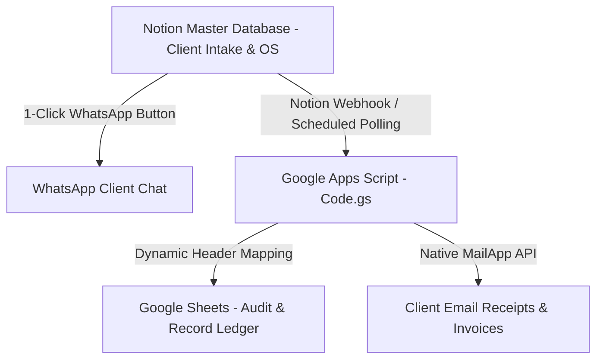

# Zero-Paywall Client OS Architecture Engine (`/zero-paywall-client-os`)

## Overview & Tri-Mode Execution

This skill designs and deploys enterprise-grade client management hubs, student desk OS systems, and operational workflow engines that operate **100% free forever** without recurring monthly SaaS subscriptions (Make.com, n8n cloud, Zapier). It pairs Notion Master Databases (free plan) as the front-end intake UI with Google Apps Script (`Code.gs`) as the serverless 24/7 backend engine, Google Sheets as the ledger, and native email/WhatsApp triggers.

Invokable via:
- **Slash Command**: `/zero-paywall-client-os`
- **Dynamic Intent**: Triggered when designing client workflows, intake systems, agency deliverables, or student management desks.
- **Programmatic Inter-Skill Calling**: Invoked by `/new-client`, `/ai-pricing-engine`, `/notion-formula-builder`, or `/interactive-operator-guide-generator`.

---

## 🏗️ 4-Layer Zero-Cost Architecture Model



1. **Intake & Workstation Layer**: Notion Master Database (Free Notion account).
2. **Serverless Engine Layer**: Google Apps Script (`Code.gs`) running on Google Cloud 24/7 with zero server costs (up to 20,000 email triggers/day free).
3. **Database Ledger Layer**: Google Sheets stored on client's Google Drive.
4. **Action Layer**: 1-Click WhatsApp URLs + native HTML emails via Apps Script `MailApp.sendEmail()`.

---

## Dynamic Header Mapping Pattern (Google Apps Script)

> **CRITICAL RULE:** Never hardcode column indices (e.g. `sheet.getRange(row, 3)`) in Google Apps Script! Reordering or adding columns in Google Sheets will silently corrupt data. ALWAYS resolve headers dynamically at runtime using `getHeaderMap()`.

```javascript
/**
 * Resolves a dynamic header map from row 1 of a Google Sheet.
 * @param {GoogleAppsScript.Spreadsheet.Sheet} sheet 
 * @returns {Object<string, number>} Object mapping column name to 1-indexed column position.
 */
function getHeaderMap(sheet) {
  var headers = sheet.getRange(1, 1, 1, sheet.getLastColumn()).getValues()[0];
  var map = {};
  for (var i = 0; i < headers.length; i++) {
    if (headers[i]) {
      map[headers[i].toString().trim()] = i + 1;
    }
  }
  return map;
}

/**
 * Upserts a row into Google Sheets matching record ID dynamically.
 */
function syncNotionRecordToSheet(sheet, recordData) {
  var headerMap = getHeaderMap(sheet);
  var lastRow = sheet.getLastRow();
  var data = lastRow > 1 ? sheet.getRange(2, 1, lastRow - 1, sheet.getLastColumn()).getValues() : [];
  
  var idCol = headerMap["Order ID"] || headerMap["ID"];
  var targetRow = -1;
  
  for (var r = 0; r < data.length; r++) {
    if (data[r][idCol - 1] == recordData.id) {
      targetRow = r + 2;
      break;
    }
  }
  
  if (targetRow === -1) {
    targetRow = lastRow + 1;
  }
  
  for (var key in recordData) {
    if (headerMap[key]) {
      sheet.getRange(targetRow, headerMap[key]).setValue(recordData[key]);
    }
  }
}
```

---

## 📋 Client Deliverable Checklist

- [ ] Notion Master Database schema with property null guards.
- [ ] Google Workspace CLI provisioned Google Sheet with formatted tabs.
- [ ] Google Apps Script `Code.gs` with dynamic header mapping.
- [ ] 1-Click WhatsApp formula button configured.
- [ ] Executive SOP Markdown guide (`03-pitch-and-loom-guides/`).
- [ ] Interactive HTML Operator Dashboard (`04-visual-assets-and-previews/`).

---

## Post-Execution Auto-Evolution & Adversarial `/roast` Gate

At the completion of every execution of this skill:

1. **Adversarial `/roast` Council Review**: Convene the 5-Persona ZORIXEL AIOS Roast Council (`/roast`) to stress-test the output, code edits, or strategy generated by this skill. Red-team for missing edge cases, terminal shell bugs, token leaks, or optimization gaps.
2. **Autonomous Tool, Script & Skill Auto-Upgrade Loop**:
   - If new error patterns or execution safeguards are discovered, append them to `references/GLOBAL_ERROR_PREVENTION_RULES.md` and execute `python scripts/sync_global_rules.py` via `run_command` so system prompts (`AGENTS.md` and `GEMINI.md`) auto-update inline.
   - Run pre-flight health checks (`aios_gws_health_check.py`, `test_notion_formula.py`, `graphify_runner.py`).
   - Self-upgrade this `SKILL.md` instruction file with newly learned edge cases using `replace_file_content` or `write_to_file`.
3. **Register & Log**: Log milestone upgrades in [WORKSPACE_MAP.md](file:///d:/AI-OS/WORKSPACE_MAP.md) and [decisions/log.md](file:///d:/AI-OS/decisions/log.md).

