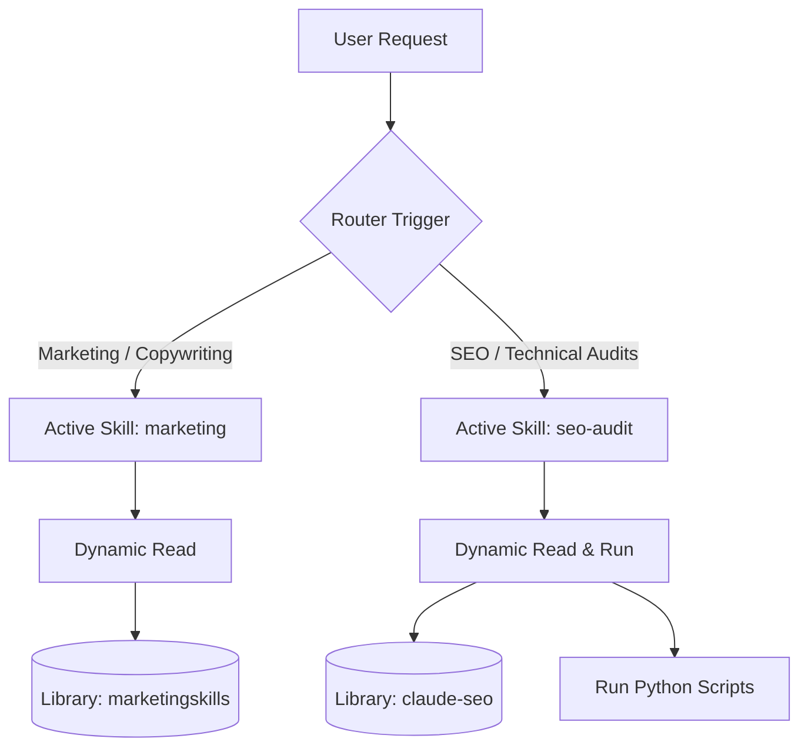

# Design Spec: Adapt Marketing and SEO-Audit Skills

Date: 2026-07-16
Status: Proposed

---

## 1. Overview & Objectives
We want to integrate the core copywriting/marketing strategies from Corey Haynes (`marketingskills`) and the technical SEO capabilities from Daniel Agrici (`claude-seo`) into Atinek's AI Operating System (AIOS).
To prevent context rot, command collision, and token bloat, we will consolidate the 70+ reference files into a static library, exposing them through two active router skills:
* `/marketing`: Copywriting, marketing psychology, content strategy, captions.
* `/seo-audit`: Technical audits, sitemap parsing, schema validation, GEO checks.

---

## 2. Directory Layout & Architecture

### Reference Library Path:
`d:\AI-OS\brain-aios\wiki\research\skills-library/`
* `marketingskills/` — Contains cloned copywriting, onboarding, pricing, and psychology files.
* `claude-seo/` — Contains cloned SEO agents, skills, and Python utility scripts.

### Workspace Active Skills:
`d:\AI-OS\.agents\skills/`
* [marketing](file:///d:/AI-OS/.agents/skills/marketing/SKILL.md) — The marketing router slash command and auto-trigger.
* [seo-audit](file:///d:/AI-OS/.agents/skills/seo-audit/SKILL.md) — The SEO audit router slash command and auto-trigger.

---

## 3. Active Skill: `marketing`
* **Trigger Terms**: copywriting, write copy, landing page, headline help, CTA copy, email copy, popup copy, pricing strategy, customer research, value proposition, taglines, Instagram captions, ZORIXEL positioning.
* **Frontmatter Name**: `marketing`
* **Workflow**:
  1. Detect sub-category (e.g., copywriting, pricing, emails, cro).
  2. Read the corresponding reference skill at `d:\AI-OS\brain-aios\wiki\research\skills-library/marketingskills/skills/{sub-category}/SKILL.md` using `view_file`.
  3. Apply the exact framework to draft, edit, or critique copy.

---

## 4. Active Skill: `seo-audit`
* **Trigger Terms**: SEO, technical SEO, schema, sitemaps, GEO, AEO, pagespeed, keywords, backlinks.
* **Frontmatter Name**: `seo-audit`
* **Workflow**:
  1. Detect sub-category (e.g., schema validation, technical audit, GEO analysis).
  2. Read the corresponding markdown guide at `d:\AI-OS\brain-aios\wiki\research\skills-library/claude-seo/agents/{agent}.md` or `skills/{seo-sub}/SKILL.md`.
  3. If a programmatic check is needed (e.g. pagespeed API check, HTML schema validator), run the python script from `d:\AI-OS\brain-aios\wiki\research\skills-library/claude-seo/scripts/{script}.py` via terminal.
  4. Output a clean dashboard report to the user.

---

## 5. Verification Plan
* **Copywriting Test**: Run a prompt asking to outline a hero section copywriting block using the PAS framework. Verify that the agent reads `copywriting/SKILL.md` and applies the PAS rules.
* **SEO Test**: Run a prompt checking schema for a sample HTML page. Verify that the agent reads `seo-schema/SKILL.md` or runs `schema_generate.py`/`schema_ecommerce_validate.py`.
