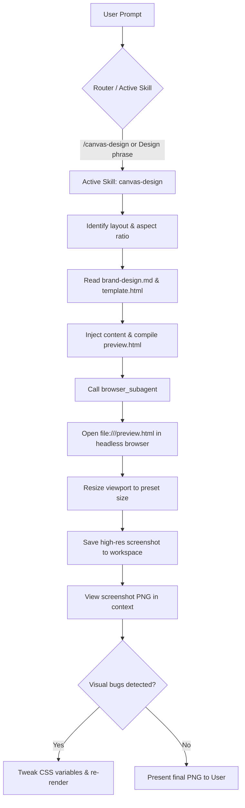

# Design Spec: Canvas Design Skill

Date: 2026-07-16
Status: Proposed

---

## 1. Overview & Objectives
The Canvas Design skill enables Atinek's AIOS to programmatically generate original static visual assets (posters, social media graphics, YouTube banners/thumbnails, brand assets) in high-resolution PNG format.
To escape "AI slop" and templated look, the visual style will default to the warm-editorial aesthetic spec described in `Temporary brand design.md` (warm cream canvas, coral accents, Copernicus slab-serif headlines, and navy product blocks).
Decoupled into:
* Static Library (`brain-aios/wiki/research/skills-library/canvas-design/`): Contains templates, stylesheets, and style guides.
* Active Skill (`.agents/skills/canvas-design/`): Auto-triggers on design phrases, generates HTML, calls `browser_subagent` to render/screenshot, and visually self-corrects.

---

## 2. Directory Layout & Architecture

### Reference Library Path:
`d:\AI-OS\brain-aios\wiki\research\skills-library/canvas-design/`
* `brand-design.md` — Cloned style guidelines from the user's Downloads folder.
* `styles.css` — Central CSS variables mapping the cream, coral, and navy typography tokens.
* `template-base.html` — Base layout containing Google Fonts integration (`Cormorant Garamond` and `Inter`) and CSS layouts.

### Workspace Active Skill:
`d:\AI-OS\.agents\skills/canvas-design/`
* [SKILL.md](file:///d:/AI-OS/.agents/skills/canvas-design/SKILL.md) — The active canvas-design router, prompt logic, and visual self-review loop.

---

## 3. Presets & Dimensions
The generator supports the following presets mapping the CSS viewport dimensions:
* `instagram-square`: 1080 x 1080 px
* `instagram-portrait`: 1080 x 1350 px
* `story-reel`: 1080 x 1920 px
* `youtube-thumbnail`: 1280 x 720 px
* `youtube-banner`: 2560 x 1440 px
* `brand-logo`: 800 x 800 px
* `brand-badge`: 500 x 500 px

---

## 4. Visual Styles & Layout Templates
* **`editorial-quote`**: Large serif display type, warm-ink color, cream canvas background, coral asterisk accent mark.
* **`code-showcase`**: Dark navy mock-window with JetBrains Mono code, status bar, and cream headers.
* **`bento-features`**: Multi-column container grids with light-cream card backgrounds.
* **`full-bleed-callout`**: High-voltage warm coral background, large white serif display headline, cream-button CTA.

---

## 5. Verification Plan
* **Trigger Test**: Request: "design an instagram-portrait poster for Zorixel cohort launch". Verify that the agent auto-triggers the skill.
* **Compilation Test**: Verify that the generated HTML correctly links the Google Font family and uses the colors (#faf9f5, #cc785c, #141413).
* **Screenshot Render Test**: Run `browser_subagent` to render the local file and verify that the output PNG is correctly created at `d:/AI-OS/brainstorms/canvas_output.png` and matches the specified viewport dimensions.
